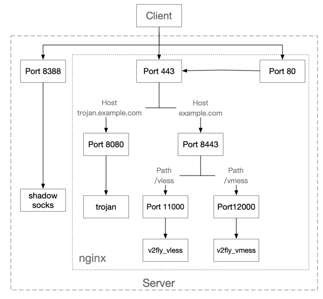

# V2Ray-Trojan-ShadowSocks_DockerCompose
https://certbot.eff.org/

use docker-compose to build v2ray/trojan/shadowSocks proxy server.

    v2fly_vless use vless protocol
    v2fly_vmess use vmess protocol
    trojan use trojan protocol
    shadowsocks use ss protocol

when you use it, you should follow these steps:

1. replace example.com and trojan.example.com to your domain name
2. apply for ssl certs by using certbot or others, and then put the certs into floder nginx/certs 
   (you can use nginx/cert.sh to apply and move certs if you have install certbot)
3. modify id in v2ray/v2fly conf (config.json), which is in floder nginx/v2fly_vmess and nginx/v2fly_vless
4. modify shadowsocks password in .env file for your own pass word (replace your_shadowsocks_password in .env file)
5. modify trojan password in ./trojan/config.json (replace your_trojan_password in ./trojan/config.json file)

after then, start docker-compose
    
    docker-compose up -d

The proxy services run as follows

In addition, how to use bbr speed
    
    wget -N --no-check-certificate "https://raw.githubusercontent.com/chiakge/Linux-NetSpeed/master/tcp.sh"
    chmod +x tcp.sh
    ./tcp.sh
